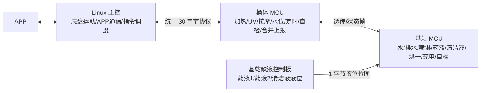
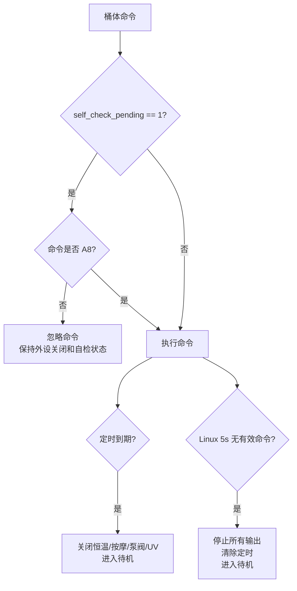
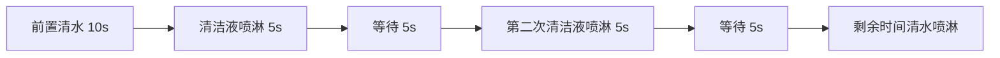
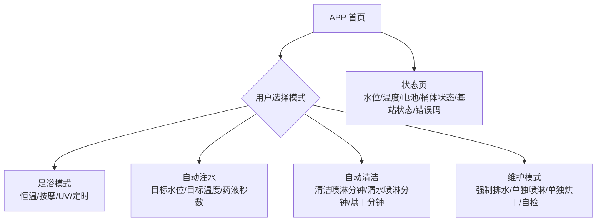
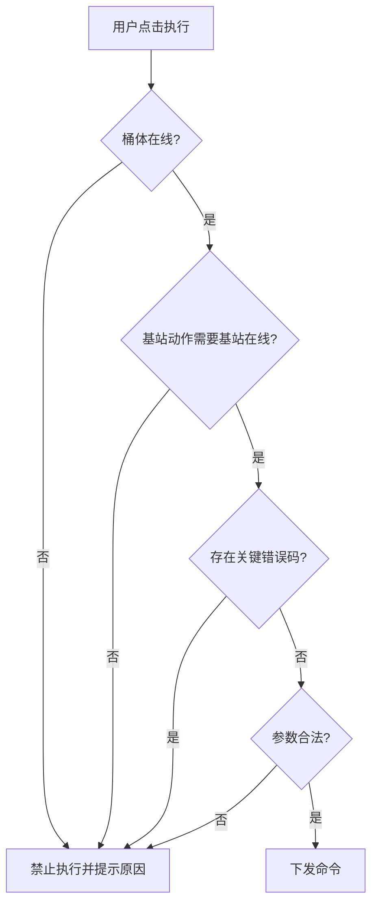
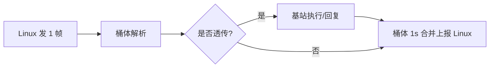

# 智能足浴桶机器人产品与研发流程图

> 适用范围：当前代码中的三端协同逻辑：桶体工程 `Foot_bath_robot_V1`、基站工程 `Foot_bath_robot_base_V2`、Linux 主控通信协议。
>
> 目标读者：产品经理、嵌入式研发、Linux/APP 研发、测试、联调人员。
>
> 说明：本文以当前代码实现为准。若协议文档、产品需求和代码存在差异，文中会在“当前代码边界/注意点”中单独标注。

## 1. 产品三端职责



三端职责边界：

| 端 | 主要职责 | 主要输入 | 主要输出 |
|---|---|---|---|
| Linux 主控 | APP 通信、底盘运动、下发足浴/清洁/基站命令、接收合并状态 | APP 指令、底盘状态 | 统一协议帧到桶体 |
| 桶体 MCU | 桶内水加热、按摩电机、UV、桶体水泵/三通阀、水位/温度/电压/电流检测、自检、合并基站数据上报 Linux | Linux 帧、基站状态帧、桶体传感器 | 1s 合并状态帧给 Linux；透传帧给基站；桶体外设控制 |
| 基站 MCU | 自动注水、自动清洁、强制排水、单独喷淋、烘干、药液/清洁液泵、喷淋杆定位、灯效、缺液保护 | 桶体透传来的 B 段命令、桶体实时水位/温度、缺液板数据 | 基站状态帧给桶体；基站外设控制 |

## 2. 统一通信协议

### 2.1 固定帧格式

```text
data[0]  = 0x55
data[1]  = 0xAA
data[2]  = 链路模式
data[3]  = 命令字
data[4..28] = 数据区
data[29] = checksum = sum(data[2]..data[28]) & 0xFF
```

链路模式：

| data[2] | 含义 | 当前代码用途 |
|---:|---|---|
| `0x01` | 桶体链路 | 桶体可接收；默认上报模式 |
| `0x02` | 透传链路 | 桶体转发给基站；基站只接收该模式 |
| `0x03` | 直连/兼容 | 桶体可接收；非透传时 C 段系统命令可本地执行 |

### 2.2 命令分区

| 命令区间 | 归属 | 典型命令 | 当前处理方式 |
|---|---|---|---|
| `0x00` | 摸鱼/空闲实时帧 | 周期携带桶体水位、温度 | 桶体不记录为最新命令；转发基站前写入 `data[5]` 水位、`data[6]` 温度 |
| `0xA0..0xAF` | 桶体命令 | A2 恒温、A4 按摩、A5 UV、A6 定时、A8 自检 | 桶体本地执行；透传模式下也可转发给基站，但基站只处理 B 段和 0x00 实时帧 |
| `0xB0..0xBF` | 基站命令 | B2 自动注水、B3 自动清洁、B4 强制排水 | 透传模式下桶体转发给基站；B2 桶体也会进入运行状态并关闭本地恒温 |
| `0xC0..0xCF` | 系统命令 | C0 软件复位 | 非透传时桶体本地执行；透传时只转发基站 |

## 3. 总体工作流

```mermaid
flowchart TD
  START[上电初始化]
  INIT1[桶体初始化\nSensor/Temp/Motor/PumpValve/UV/System/Log/UART]
  INIT2[基站初始化\nColorLight/Motor/System/Log/UART]
  IDLE[等待 Linux/APP 指令]
  CMD{Linux 下发命令}
  A[A 段桶体功能]
  B[B 段基站功能]
  C[C 段系统功能]
  STATUS[桶体每 1s 上报合并状态给 Linux]
  BASE_STATUS[基站每 1s/收到帧后\n上报基站状态给桶体]

  START --> INIT1 --> IDLE
  START --> INIT2 --> IDLE
  IDLE --> CMD
  CMD -->|A0-A9| A --> STATUS
  CMD -->|B0-B9 且 data[2]=0x02| B --> BASE_STATUS --> STATUS
  CMD -->|C0-CF| C --> STATUS
  STATUS --> IDLE
```

核心产品逻辑：

1. Linux 是指令入口，所有桶体/基站业务原则上都从 Linux 下发。
2. 桶体是通信汇聚点：Linux 不直接和基站通信，Linux 发给基站的 B 段命令先到桶体，再由桶体转发基站。
3. 桶体给 Linux 的普通上报收敛为每 1s 一帧合并状态：`data[0..15]` 是桶体状态，`data[16..28]` 是基站状态。
4. 基站在线时，桶体合并最近一次基站状态；基站离线时，桶体上报帧中的基站区域保持 0。
5. 自检是例外：桶体 A8 自检开始和自检完成会保留单独回包，方便上位机及时看到状态变化。

## 4. 桶体通信流程

```mermaid
flowchart TD
  RX[桶体收到 Linux 30 字节帧]
  VALID{帧头/校验/链路模式有效?}
  DROP[丢弃]
  RECORD[记录主控在线时间\n更新 last_link_mode]
  CMD{data[3] 命令字}
  IDLE[0x00 摸鱼帧]
  A[A0-A9 桶体本地执行]
  B[B0-BF 基站命令]
  C[C0-CF 系统命令]
  TRANSIT{data[2] == 0x02?}
  FWD_IDLE[转发基站前写入\ndata[5]=桶体实际水位\ndata[6]=桶体实际温度\n重算校验]
  FWD_RAW[原帧转发基站]
  LOCAL[桶体执行外设动作]
  PERIOD[等待 1s 周期合并上报]

  RX --> VALID
  VALID -->|否| DROP
  VALID -->|是| RECORD --> CMD
  CMD -->|0x00| IDLE --> TRANSIT
  TRANSIT -->|是| FWD_IDLE --> PERIOD
  TRANSIT -->|否| PERIOD
  CMD -->|A0-A9| A --> LOCAL --> TRANSIT
  CMD -->|B0-BF| B --> TRANSIT
  CMD -->|C0-CF| C --> TRANSIT
  TRANSIT -->|是 且非0x00| FWD_RAW --> PERIOD
  TRANSIT -->|否| PERIOD
```

桶体上传 Linux 的规则：

```mermaid
flowchart TD
  TICK[通信任务 50ms 周期]
  SELF_START{收到 A8 自检命令?}
  SELF_DONE{自检 5s 到期?}
  ONE_SEC{距离上次状态上报 >= 1000ms?}
  BUILD[构造桶体状态帧]
  MERGE{基站在线?\n最近 3s 收到合法基站帧}
  COPY[复制 base_data 到 data[16..28]]
  ZERO[基站区保持 0]
  SEND[发给 Linux]

  TICK --> SELF_START
  SELF_START -->|是| BUILD --> SEND
  SELF_START -->|否| SELF_DONE
  SELF_DONE -->|是| BUILD --> SEND
  SELF_DONE -->|否| ONE_SEC
  ONE_SEC -->|是| BUILD --> MERGE
  MERGE -->|是| COPY --> SEND
  MERGE -->|否| ZERO --> SEND
  ONE_SEC -->|否| TICK
```

### 4.1 Linux 合并状态帧字段

| 字段 | 含义 | 当前代码来源 |
|---|---|---|
| `data[0]` | 帧头 1 | `0x55` |
| `data[1]` | 帧头 2 | `0xAA` |
| `data[2]` | 最近一次合法 Linux 帧链路模式 | `last_link_mode` |
| `data[3]` | 普通周期上报命令字 | 固定 `0x00`；A8 单独回包时为 `0xA8` |
| `data[4]` | 基站在线状态 | 3s 内收到合法基站帧为 1，否则 0 |
| `data[5]` | 桶体实际水位 | `Sensor_GetWaterLevelProtocol()`，单位 L，协议最大 12L |
| `data[6]` | 桶体实际温度 | 温度传感器正常时四舍五入整数温度；异常为 0 |
| `data[7]` | 按摩电机档位 | `Motor_GetLevel()` |
| `data[8]` | UV 状态 | `UV_IsOn()` |
| `data[9]` | 定时剩余分钟 | `SystemMonitor_GetTimerRemainingMin()` |
| `data[10..11]` | 电池百分比 | `data[10]=0x00`；`data[11]`中间百分比使用BCD，18.5V及以下=`0x00`，25.0V及以上=`0xFF` |
| `data[12]` | 桶体主状态 | 见桶体状态表 |
| `data[13]` | 桶体子状态 | 当前多用于定时剩余分钟或 0 |
| `data[14]` | 桶体错误码 1 | 传感器/水位/温度类 |
| `data[15]` | 桶体错误码 2 | 执行器/电池类 |
| `data[16..28]` | 基站状态区 | 基站在线时复制最近基站状态，否则 0 |
| `data[29]` | 校验 | `sum(data[2..28]) & 0xFF` |

## 5. 桶体本地功能流程

### 5.1 桶体命令表

| 命令 | 功能 | 关键字段 | 执行动作 | 状态变化 |
|---|---|---|---|---|
| `A0` | 关闭 | - | 关闭恒温/按摩/泵阀/UV；清定时 | `OFF=2` |
| `A1` | 待机 | - | 关闭所有输出；清定时 | `STANDBY=3` |
| `A2` | 开启恒温 | `data[6]` 目标温度，`data[9]` 子状态 | 设置目标温度；开恒温；桶体泵阀内循环 | `RUNNING=4` |
| `A3` | 关闭恒温 | - | 关恒温；若 UV 也关闭则关桶体泵阀 | `RUNNING=4` |
| `A4` | 按摩 | `data[7]` 档位 | 设置按摩电机档位 | 档位 0 待机，否则运行 |
| `A5` | UV | `data[8]` 0/1 | 开 UV 时打开桶体内循环；关 UV 且恒温未开时关泵阀 | 0 待机，否则运行 |
| `A6` | 定时 | `data[9]` 定时代码 | 只设置倒计时，不改变温度/按摩/UV/泵阀 | `RUNNING=4`，子状态为剩余分钟 |
| `A7` | 停止所有 | - | 关闭所有输出；清定时 | `STANDBY=3` |
| `A8` | 自检 | - | 关闭输出，清错误，进入 5s 自检保护 | `SELF_CHECK=1` |
| `A9` | 低功耗 | - | 关闭所有输出 | `LOW_POWER=5` |
| `B2` | 自动注水协同 | `data[16]` 目标水位，`data[6]` 目标温度 | 桶体关闭本地恒温并转发基站，由基站执行注水/加热 | `RUNNING=4` |
| `B4` | 调试排水 | - | 桶体泵阀直接进入排水模式；透传时也发给基站 | `RUNNING=4` |

### 5.2 桶体命令互斥和保护



互斥规则：

- 自检期间只允许 A8 重新触发自检，其它 A 段桶体命令不执行。
- A6 定时只改变倒计时，不主动改变温度、按摩、UV、桶体泵阀。
- 定时结束时统一关闭恒温、按摩、水泵/阀、UV，然后进入待机。
- 恒温和 UV 都可能要求桶体内循环：关闭恒温时，如果 UV 仍开，不关闭泵；关闭 UV 时，如果恒温仍开，不关闭泵。
- 基站同步排水优先级高于普通循环：基站状态为排水状态时，桶体泵阀进入排水模式。

### 5.3 桶体状态码

| 主状态 | 名称 | 含义 |
|---:|---|---|
| `0` | POWER_ON | 上电 |
| `1` | SELF_CHECK | 自检 |
| `2` | OFF | 关闭 |
| `3` | STANDBY | 待机 |
| `4` | RUNNING | 运行 |
| `5` | LOW_POWER | 低电量保护 |

### 5.4 桶体安全边界

| 项 | 当前代码边界 | 触发后动作 |
|---|---:|---|
| 水位最大协议值 | 12L | 水位上报不应超过协议最大值 |
| 安全水位 | 1L | 加热/内循环/UV 需要水，低于 1L 上报缺水错误 |
| 温控目标范围 | 35C~48C | 目标温度会被限制到范围内 |
| 温控回差 | 低 0.5C 开热，高 0.3C 停热 | 避免继电器频繁开关 |
| 超温 | >=55C | 上报温度异常 |
| 加热超时 | 15min | 仍低于目标回差则停热并上报加热模块故障 |
| 泵过流 | >3000mA | 关泵并上报泵故障 |
| 桶体排水超时 | 5min 且水位仍 >0L | 关泵并上报泵故障 |
| Linux 主控超时 | 5s 无有效帧 | 停止所有桶体输出，清定时，进入待机 |
| 基站离线判定 | 3s 无合法基站帧 | Linux 上报中 `data[4]=0`，基站数据区清 0 |

## 6. 基站通信流程

```mermaid
flowchart TD
  RX[基站收到桶体 USART3 帧]
  VALID{帧头正确?\ndata[2]==0x02?\n校验正确?}
  DROP[丢弃]
  ONLINE[刷新桶体在线时间\n保存 last_bucket_frame]
  CMD{data[3]}
  B[B0-BF]
  IDLE[0x00 摸鱼实时帧]
  OTHER[其它命令忽略业务]
  HANDLE[Base_HandleCommand]
  REAL[更新桶体实时水位/温度\nBase_UpdateBucketRealtimeData]
  REPLY[立即回一帧基站状态给桶体]
  PERIOD[每 1s 主动上报基站状态]

  RX --> VALID
  VALID -->|否| DROP
  VALID -->|是| ONLINE --> CMD
  CMD -->|B0-BF| B --> HANDLE --> REPLY
  CMD -->|0x00| IDLE --> REAL --> REPLY
  CMD -->|其它| OTHER --> REPLY
  PERIOD --> REPLY
```

基站通信注意点：

- 基站只解析 `data[2] == 0x02` 的透传帧。
- 收到合法帧立即回基站状态帧，同时基站也每 1s 主动发一次状态帧。
- `data[3] == 0x00` 不作为业务命令，只作为桶体实时水位/温度入口。
- 基站 5s 未收到桶体有效帧，判定桶体离线；若当前阶段需要桶体配合内循环或自动注水，则停止流程回待机。

## 7. 基站状态帧字段

基站自身状态由 `Base_BuildStatusData()` 写入，再由桶体合并到 Linux 上报帧的 `data[16..28]`。

| 字段 | 含义 | 当前代码来源 |
|---|---|---|
| `data[4]` | 桶体在线状态 | 5s 内收到合法桶体帧为 1 |
| `data[16]` | 进水阀输出 | GPIO `WATER_IN` |
| `data[17]` | 清洁液喷淋设定分钟 | 最近命令 `data[17]` |
| `data[18]` | 清水/热水喷淋设定分钟 | 最近命令 `data[18]` |
| `data[19]` | 烘干设定分钟 | 最近命令 `data[19]` |
| `data[20]` | 药液泵1剩余秒数 | 命令 `data[20]` 秒级倒计时 |
| `data[21]` | 药液泵2剩余秒数 | 命令 `data[21]` 秒级倒计时 |
| `data[22]` | 清洁液泵输出 | GPIO `CLEAN_PUMP` |
| `data[23]` | 基站主状态 | 见状态表 |
| `data[24]` | 时间字段 | 定时状态为剩余分钟；非定时状态为已持续秒数；最大 255 |
| `data[25]` | 基站错误码 1 | 缺液/泵类 |
| `data[26]` | 基站错误码 2 | 执行器类 |
| `data[27]` | 氛围灯逻辑状态 | 错误=4，烘干=3，定时动作=2，否则 0 |
| `data[28]` | 请求桶体内循环 | 当前代码由基站原始状态帧写入，桶体合并后 Linux 可见 |

## 8. 基站主状态 `data[23]`

| 状态值 | 名称 | 产品含义 | 桶体联动 |
|---:|---|---|---|
| `0x00` | POWER_ON | 基站上电 | 无 |
| `0x01` | SELF_CHECK | 基站自检 | 无 |
| `0x02` | OFF | 关闭 | 桶体若由基站同步打开泵阀，则关闭 |
| `0x03` | STANDBY | 待机 | 桶体若由基站同步打开泵阀，则关闭 |
| `0x04` | AUTO_FILL | 自动注水 | 无，桶体通过 0x00 实时帧提供水位/温度 |
| `0x05` | FILL_KEEP_WARM | 注水完成，需要保温 | 无 |
| `0x06` | FILL_WAIT_DRAIN | 注水完成，等待排水/下一步 | 无 |
| `0x07` | CLEAN_SPRAY | 自动清洁：清洁液喷淋 | 桶体开启内循环 |
| `0x08` | CLEAN_DRAIN1 | 自动清洁：清洁喷淋后排水 | 桶体开启排水 |
| `0x09` | CLEAR_SPRAY | 自动清洁：清水/热水喷淋 | 桶体开启内循环 |
| `0x0A` | CLEAR_DRAIN2 | 自动清洁：清水喷淋后排水 | 桶体开启排水 |
| `0x0B` | CLEAN_DRY | 自动清洁：热风烘干 | 桶体关闭基站同步泵阀 |
| `0x0C` | FORCE_DRAIN | 第一次排水/强制排水/单独喷淋后排水 | 桶体开启排水 |
| `0x0D` | SINGLE_CLEAN_SPRAY | 单独清洁液喷淋 | 当前桶体代码不按该状态开内循环 |
| `0x0E` | SINGLE_CLEAR_SPRAY | 单独清水/热水喷淋 | 当前桶体代码不按该状态开内循环 |
| `0x0F` | SINGLE_DRY | 单独烘干 | 无 |

桶体根据基站 `data[23]` 的同步规则：

```mermaid
flowchart TD
  BASE_STATUS[收到基站状态帧]
  S{data[23]}
  DRAIN[0x08/0x0A/0x0C\n桶体泵阀=排水]
  CIRC[0x07/0x09\n桶体泵阀=内循环]
  OTHER[其它状态]
  OFF1{当前桶体泵阀是排水?}
  OFF2{当前桶体泵阀是内循环\n且恒温关、UV关?}
  CLOSE[关闭桶体泵阀]
  KEEP[保持桶体自身功能需要的泵阀状态]

  BASE_STATUS --> S
  S --> DRAIN
  S --> CIRC
  S --> OTHER
  OTHER --> OFF1
  OFF1 -->|是| CLOSE
  OFF1 -->|否| OFF2
  OFF2 -->|是| CLOSE
  OFF2 -->|否| KEEP
```

## 9. 自动注水 B2 流程

业务目标：Linux 下发目标水位和目标温度，基站执行进水/加热；桶体通过摸鱼帧持续提供实际水位和实际温度；达到目标水位后基站停止注水。

关键字段：

| 字段 | 含义 |
|---|---|
| `data[3]=0xB2` | 自动注水命令 |
| `data[16]` | 目标水位，当前基站代码只用这个字段作为目标水位 |
| `data[6]` | 目标温度，B2 中作为基站注水加热目标温度 |
| `0x00` 摸鱼帧 `data[5]` | 桶体实际水位 |
| `0x00` 摸鱼帧 `data[6]` | 桶体实际温度 |
| `data[20]`、`data[21]` | 药液泵1/2投放秒数，B2 启动时可同步计时投放 |

```mermaid
flowchart TD
  LINUX[Linux 下发 B2\ndata[16]=目标水位\ndata[6]=目标温度]
  BUCKET[桶体收到 B2]
  BUCKET_ACT[桶体关闭本地恒温\n设置运行状态\n透传 B2 给基站]
  BASE_START[基站启动自动注水\n保存目标水位/温度\n打开 WATER_IN\n目标温度非0则打开 EN_HEAT]
  IDLE[Linux 周期发送 0x00 摸鱼帧]
  UPDATE[桶体写入实际 data[5] 水位\ndata[6] 温度\n转发基站]
  JUDGE{实际水位 >= 目标水位?}
  HEAT{实际温度 < 目标温度?}
  KEEP[继续进水\n按温度开关 EN_HEAT]
  STOP[关闭 WATER_IN 和 EN_HEAT\n自动注水结束]
  NEXT{目标温度是否非0?}
  KEEP_WARM[状态 0x05\nFILL_KEEP_WARM]
  WAIT_DRAIN[状态 0x06\nFILL_WAIT_DRAIN]

  LINUX --> BUCKET --> BUCKET_ACT --> BASE_START
  BASE_START --> IDLE --> UPDATE --> JUDGE
  JUDGE -->|否| HEAT
  HEAT --> KEEP --> IDLE
  JUDGE -->|是| STOP --> NEXT
  NEXT -->|是| KEEP_WARM
  NEXT -->|否| WAIT_DRAIN
```

自动注水边界：

- `data[16]` 为目标水位；不要再用 B2 帧中的 `data[5]` 当实际水位。
- 实际水位只来自 `data[3]==0x00` 摸鱼实时帧的 `data[5]`。
- 基站只有收到过有效实时水位后，排水/注水判断才可靠。
- 若目标水位为 0，当前代码会在下一次实际水位判断时满足 `current_water >= target_water`，因此产品侧不应把 0 当作有效注水目标。
- 当前代码中注水没有独立最长超时，需要靠主控/桶体通信超时、人工停止或后续需求补充。

## 10. 自动清洁 B3 流程

业务目标：自动完成“排水 -> 清洁液喷淋 -> 排水 -> 清水/热水喷淋 -> 排水 -> 热风烘干 -> 待机”。

关键字段：

| 字段 | 含义 |
|---|---|
| `data[3]=0xB3` | 自动清洁命令 |
| `data[17]` | 清洁液喷淋总时长，单位分钟 |
| `data[18]` | 清水/热水喷淋时长，单位分钟 |
| `data[19]` | 热风烘干时长，单位分钟 |

```mermaid
flowchart TD
  START[B3 自动清洁开始]
  D1[阶段1：排桶内残留水\n基站 data[23]=0x0C\n基站 WATER_OUT 开\n桶体同步排水]
  E1{排水结束?\n收到 0L 后延时 或 最大排水保护}
  CS[阶段2：清洁液喷淋\n喷淋杆到 90度\ndata[23]=0x07\n基站进水+清洁液泵\n桶体内循环]
  T1{data[17] 分钟到期?}
  D2[阶段3：排清洁喷淋后的水\ndata[23]=0x08\n基站排水\n桶体同步排水]
  E2{排水结束?}
  HS[阶段4：清水/热水喷淋\n喷淋杆到 90度\ndata[23]=0x09\n基站进水+加热\n桶体内循环]
  T2{data[18] 分钟到期?}
  D3[阶段5：排清水喷淋后的水\ndata[23]=0x0A\n基站排水\n桶体同步排水]
  E3{排水结束?}
  DRY[阶段6：热风烘干\ndata[23]=0x0B\n风机+加热输出\n桶体关闭同步泵阀]
  T3{data[19] 分钟到期?}
  END[结束：喷淋杆回排水位\n所有输出关闭\n基站待机 data[23]=0x03]

  START --> D1 --> E1
  E1 --> CS --> T1
  T1 --> D2 --> E2
  E2 --> HS --> T2
  T2 --> D3 --> E3
  E3 --> DRY --> T3
  T3 --> END
```

### 10.1 清洁液喷淋内部节拍

自动清洁中的清洁液喷淋阶段不是一直开清洁液泵，当前基站代码内部分段如下：



边界：

- 清洁液喷淋总时长仍由 `data[17]` 分钟决定。
- 若 `data[17]` 太短，状态机仍会按动作截止时间推进，内部节拍可能只执行前半段。
- 清洁液缺液时，基站关闭 `CLEAN_PUMP`；若正在清洁液喷淋动作，会停止喷淋流程并回待机。

### 10.2 排水结束条件

```mermaid
flowchart TD
  DRAIN[进入排水阶段]
  POS[喷淋杆先到排水位 0度]
  OUT[基站 WATER_OUT 打开\n桶体根据 data[23] 同步排水]
  REAL{收到 0x00 实时帧?}
  ZERO{桶体实际水位 data[5] == 0L?}
  AFTER[启动 0L 后继续排水延时]
  DONE[延时到期，进入下一阶段]
  MAX{超过最大排水保护?}
  FORCE_NEXT[强制进入下一阶段/待机]

  DRAIN --> POS --> OUT --> REAL
  REAL -->|否| MAX
  REAL -->|是| ZERO
  ZERO -->|否| MAX
  ZERO -->|是| AFTER --> DONE
  MAX -->|否| REAL
  MAX -->|是| FORCE_NEXT
```

当前代码边界：

- 基站默认排水动作进入后，会先等待喷淋杆到 0 度，再打开排水输出。
- 基站收到桶体 0L 后，当前代码 `BASE_DRAIN_AFTER_EMPTY_MS = 100s`，不是 30s。若产品需求是 30s，需要修改为 `30UL * 1000UL`。
- 如果一直没有收到 0L，当前代码最大排水保护是 `BASE_DRAIN_MAX_MS = 10min`，到期后状态机推进。
- 桶体自身还有排水超时保护：桶体排水模式 5min 后水位仍 >0L，会关闭桶体泵并上报故障。

## 11. 单独基站动作流程

```mermaid
flowchart TD
  CMD{基站单独命令}
  B4[B4 强制排水\ndata[23]=0x0C\n桶体同步排水]
  B5[B5 单独清洁液喷淋\ndata[23]=0x0D\n到期后进入后置排水 0x0C]
  B6[B6 单独清水/热水喷淋\ndata[23]=0x0E\n到期后进入后置排水 0x0C]
  B7[B7 单独烘干\ndata[23]=0x0F]
  B8[B8 基站自检\ndata[23]=0x01]
  END[结束后待机/关闭]

  CMD --> B4 --> END
  CMD --> B5 --> END
  CMD --> B6 --> END
  CMD --> B7 --> END
  CMD --> B8 --> END
```

注意：

- 单独 B5/B6 喷淋阶段当前桶体代码没有根据 `0x0D/0x0E` 自动开内循环；喷淋结束后的后置排水使用 `0x0C`，桶体会同步排水。
- B4、B5 后置排水、B6 后置排水都统一使用 `data[23]=0x0C`，桶体按排水处理。
- B7 烘干会打开基站风机和加热输出，桶体不需要内循环或排水。

## 12. 异常与保护总览

```mermaid
flowchart TD
  RUN[任意运行流程]
  SENSOR{传感器/通信/液位/电流异常?}
  BUCKET_ERR[桶体错误码 data[14..15]\n必要时关闭桶体输出]
  BASE_ERR[基站错误码 data[25..26]\n必要时关闭对应输出]
  REPORT[1s 合并状态上报 Linux]
  PM[产品/APP 根据错误码提示用户\n或禁止继续动作]

  RUN --> SENSOR
  SENSOR -->|桶体侧| BUCKET_ERR --> REPORT --> PM
  SENSOR -->|基站侧| BASE_ERR --> REPORT --> PM
```

### 12.1 桶体错误码

`data[14]` 桶体错误码 1：

| 位 | 值 | 含义 |
|---|---:|---|
| bit0 | `0x01` | 缺水：加热/内循环/UV 需要水但水位 <1L |
| bit1 | `0x02` | 排水超时 |
| bit2 | `0x04` | 温度异常，当前温度 >=55C |
| bit3 | `0x08` | 加热超时，当前头文件定义存在但代码目前通过 err2 加热模块故障体现 |
| bit4 | `0x10` | 温度传感器异常 |
| bit5 | `0x20` | 水位传感器异常 |

`data[15]` 桶体错误码 2：

| 位 | 值 | 含义 |
|---|---:|---|
| bit0 | `0x01` | 加热模块故障 |
| bit1 | `0x02` | 水泵故障 |
| bit2 | `0x04` | 阀门故障，当前定义保留 |
| bit3 | `0x08` | 按摩电机故障 |
| bit4 | `0x10` | UV 故障 |
| bit5 | `0x20` | 电池电压异常，低于 20.0V 或高于 26.0V；低压会进入低功耗并关输出 |

### 12.2 基站错误码

`data[25]` 基站错误码 1：

| 位 | 值 | 含义 |
|---|---:|---|
| bit0 | `0x01` | 药液泵1缺液 |
| bit1 | `0x02` | 药液泵2缺液 |
| bit2 | `0x04` | 清洁液缺液 |
| bit3 | `0x08` | 缺液控制板通信/检测异常，5s 超时 |
| bit4 | `0x10` | 药液泵1故障，当前定义保留 |
| bit5 | `0x20` | 药液泵2故障，当前定义保留 |
| bit6 | `0x40` | 清洁泵故障，当前定义保留 |

`data[26]` 基站错误码 2：

| 位 | 值 | 含义 |
|---|---:|---|
| bit0 | `0x01` | 进水阀/进水通道故障，当前定义保留 |
| bit1 | `0x02` | 加热输出故障，当前定义保留 |
| bit2 | `0x04` | 喷淋杆电机故障 |
| bit3 | `0x08` | 排水输出故障，当前定义保留 |
| bit4 | `0x10` | 烘干风机故障，当前定义保留 |
| bit5 | `0x20` | 氛围灯故障，当前定义保留 |
| bit6 | `0x40` | 红外输出故障，当前定义保留 |

## 13. 产品流程规划建议

### 13.1 APP/产品功能入口



建议产品侧把功能分成四类：

1. 足浴体验：A2/A3 恒温、A4 按摩、A5 UV、A6 定时、A7 停止。
2. 上水准备：B2 自动注水，必须配置目标水位；可选目标温度、药液投放秒数。
3. 清洁维护：B3 自动清洁，配置清洁液喷淋、清水喷淋、烘干时间。
4. 工程/售后：B4 强制排水、B5/B6/B7 单项动作、A8/B8 自检、C0 复位。

### 13.2 下发前置判断建议



建议的产品判断：

- 自动注水 B2：目标水位必须 >0 且不超过桶体协议最大水位 12L。
- 桶体恒温 A2：目标温度建议限制 35C~48C；低于 1L 时不建议允许开启。
- UV A5：低于 1L 时不建议开启，因为当前桶体会判缺水。
- 自动清洁 B3：基站必须在线；清洁液缺液时禁止或提示无法完整清洁。
- 单独清洁液喷淋 B5：清洁液缺液时禁止。
- 强制排水 B4：允许在桶体在线且无严重泵故障时执行。
- 自检 A8/B8：自检期间禁止其它动作按钮，避免用户认为按钮失效。

## 14. 研发联调检查清单

### 14.1 通信联调



检查点：

- Linux 发 `0x00`，桶体转发基站前必须刷新 `data[5]` 水位、`data[6]` 温度并重算校验。
- Linux 发普通 A 段命令后，Linux 不应立即收到桶体普通确认帧，只等 1s 周期合并状态；A8 自检除外。
- Linux 发 B 段命令且 `data[2]=0x02`，桶体应原帧转发基站。
- 基站离线超过 3s，Linux 合并帧 `data[4]=0` 且 `data[16..28]=0`。
- 基站收到合法桶体帧后会立即回一帧，也会每 1s 主动回一帧；这些帧只到桶体，不应直接到 Linux。

### 14.2 自动注水联调

- 发 B2：`data[16]=目标水位`，确认基站 `data[23]=0x04`、`data[16]=1`。
- 周期发 0x00：`data[5] < 目标水位`，确认继续进水。
- 周期发 0x00：`data[5] >= 目标水位`，确认 `WATER_IN=0`、`EN_HEAT=0`，状态进入 `0x05` 或 `0x06`。
- 温度低于目标时，确认基站 `EN_HEAT=1`；温度达到目标时，确认 `EN_HEAT=0`。

### 14.3 自动清洁联调

- 发 B3，确认第一阶段 `data[23]=0x0C`，基站排水、桶体同步排水。
- 基站进入 `0x07`，确认桶体内循环。
- 基站进入 `0x08`，确认桶体排水。
- 基站进入 `0x09`，确认桶体内循环。
- 基站进入 `0x0A`，确认桶体排水。
- 基站进入 `0x0B`，确认桶体同步排水/循环关闭，基站烘干打开。
- 流程结束，确认基站 `0x03` 待机，桶体同步泵阀关闭。

### 14.4 异常联调

- 桶体水位 <1L 时开恒温/UV/内循环，确认桶体 `data[14] bit0` 缺水。
- 断开基站 3s，确认 Linux 上报基站区清 0。
- 断开桶体到基站 5s，确认基站认为桶体离线；若正在自动注水或需要桶体内循环，则回待机。
- 基站缺液板 5s 无数据，确认基站 `data[25] bit3`。
- 桶体排水超过 5min 且水位仍 >0L，确认桶体关泵并上报泵故障。
- 基站排水没有收到 0L，确认最长 10min 后推进流程。

## 15. 当前代码需要产品确认的点

| 点 | 当前代码 | 需要确认 |
|---|---|---|
| 基站 0L 后继续排水 | `100s` | 之前需求提到 `30s`，若最终需求是 30s，需要改代码 |
| 单独 B5/B6 喷淋时桶体内循环 | 桶体只对 `0x07/0x09` 开内循环，不对 `0x0D/0x0E` 开 | 单独喷淋是否也要求桶体内循环 |
| 自动注水最长超时 | 当前没有独立注水超时 | 是否需要防止水位传感器异常导致一直进水 |
| B2 目标水位为 0 | 当前会被视作已达到目标 | APP/Linux 应禁止 0，或固件增加保护 |
| 基站状态上报 `data[28]` | 基站写请求桶体内循环；桶体实际同步主要看 `data[23]` | 后续协议是否保留 `data[28]` 作为冗余/兼容字段 |
| A8 自检上报 | 保留单独回包 | Linux 端解析要允许自检例外帧 |

## 16. 一句话产品闭环

用户在 APP 发起功能，Linux 统一下发协议帧；桶体本地执行 A 段能力，并把 B 段透传给基站；基站执行水路、喷淋、烘干、药液等复杂流程；桶体持续把自身实时水位/温度补给基站，又把桶体区和基站区合并成 1s 一帧状态返回 Linux，形成“指令下发、三端协同、状态闭环、异常保护”的完整产品逻辑。